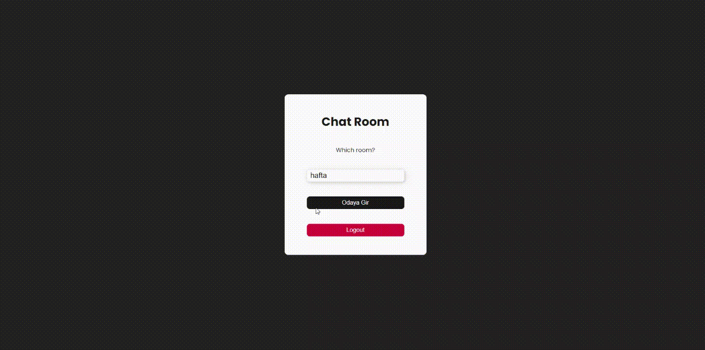

# Chat App

This project is a chat application that allows users to send messages in real-time. It has been developed using Firebase and React.

## Features

- **User Authentication**: Users can sign in using Firebase Authentication.
- **Real-Time Messaging**: Messages are sent and received in real-time using Firebase Firestore.
- **User Profiles**: Each user has a profile.
- **Multiple Chat Rooms**: Users can participate in different chat rooms.

## Requirements

- **Node.js and npm**: Make sure to install [Node.js](https://nodejs.org/).
- **Firebase Account and Project**: Create a Firebase account and set up a project at [Firebase](https://firebase.google.com/).

## Libraries and Technologies

- **JavaScript**
- **React**
- **SCSS**
- **Firebase**

## Preview

# Chat-Room---Firebase
